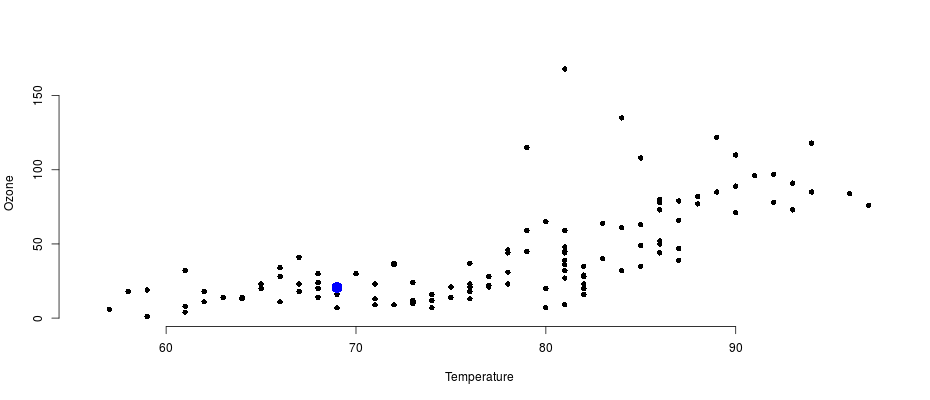

Data Product (Assignment Four)
========================================================
author: Saptarshi Lahiri
date: 24-Sep-2017
autosize: true
font-family: 'Helvetica'

Overview
========================================================


This Shiny application will help you predicting OZONE level for a given value of Temperature ( in Degree Farenhite )

- Open the application using the below link  
https://saptarshi.shinyapps.io/data_product_assignment_4/

- Select a temperature value through the slider
- Click on the PREDICT button
- See the predicted value as a 'BLUE' dot on the graph
- Hover your mouse over the graph to see the value

Relevant code for this assignment is stored in GitHub Repository
https://github.com/saptarshihere/DataProductAssignmentFour/


Relevant Code
========================================================

```r
library(shiny)
data("airquality")
#Internal airquality data has been used

# Server definition
shinyServer(function(input, output) {
  # Fit a linear model
  airq<-na.omit(airquality)
  ozl<-airq$Ozone
  Temp<-airq$Temp
  model1<-lm(ozl~Temp)
  # Predict
  model1pred<-reactive({
    TempInput<-input$sliderTemp
    predict(model1, newdata=data.frame(Temp=TempInput))
  })
  
  # Plot it
  output$plot1<-renderPlot({
    TempInput<-input$sliderTemp
    plot(airquality$Temp, airquality$Ozone, xlab = "Temperature", ylab = "Ozone", bty="n", pch=16)
    points(TempInput, model1pred(), col="blue", pch=16, cex=2)
  })
  
  # Output
  output$pred1<-renderText({
    model1pred()
  })
  
})
```
Data Set Summary
========================================================

```r
setwd("E:/DataScience/Workspace")
summary(airquality[,c('Ozone','Temp')])
```

```
     Ozone             Temp      
 Min.   :  1.00   Min.   :56.00  
 1st Qu.: 18.00   1st Qu.:72.00  
 Median : 31.50   Median :79.00  
 Mean   : 42.13   Mean   :77.88  
 3rd Qu.: 63.25   3rd Qu.:85.00  
 Max.   :168.00   Max.   :97.00  
 NA's   :37                      
```
Output Plot 
========================================================



